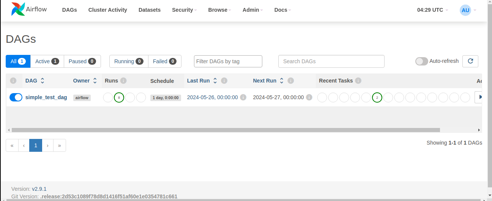

# Comprehensive ETL Workflow


> **Note:**
> This repository simulates in a simple way an ETL environment with AWS integration, without the need for a repository to be used in a professional environment.

## Summary

- [Introduction](#introduction)
- [Apache Airflow with Docker and Docker-Compose](#apache-airflow-with-docker-and-docker-compose)
- [Amazon Web Services](#integrated-with-amazon-web-services)
- [Using the Apache Airflow](#initializing-the-apache-airflow-environment)


## Introduction

This project has the main objective of showing how an ETL (Extract, Transform and Load) process works in a production environment. Nowadays, data has become a totally precious and important material for any company, since data bring results or insights for decision making, therefore the ETL process is extremely important so that we can always have data available so that we can generate even more value, this example we use **Apache Airflow**, **Postgres**, **Redis** and **AWS**.

>**Note:**
> If you want to know what ETL is and how it works: [ETL.](https://www.oracle.com/pt/integration/what-is-etl/)

## Apache Airflow with Docker and Docker-Compose

### Introduction

Apache Airflow is a powerful platform used to programmatically create, schedule, and monitor workflows. It allows you to define your workflows as directed acyclic graphs (DAGs) of tasks. Airflow's flexibility and scalability make it the ideal choice for managing complex workflows.

>**Note:**
> If want know more about Apache Airflow: [Apache Airflow.](https://airflow.apache.org/docs/apache-airflow/stable/index.html)


### Why Docker-Compose?

We have chosen to deploy Apache Airflow using Docker and Docker Compose due to the numerous benefits these tools offer:

### Docker 

Docker is a platform that allows you to package applications and their dependencies into a standardized unit called a container. Here are some key benefits:

- **Consistency**: Ensures that your application runs the same way, regardless of where it is deployed

- **Isolation**: Each container runs in its own isolated environment, which helps in avoiding conflicts between different applications.

- **Scalability**: Easily scale your application up or down by adding or removing containers.

### Docker-Compose 

Docker Compose is a tool for defining and running multi-container Docker applications. It allows you to configure your application’s services in a YAML file, making it easy to manage and scale. Benefits include:

**Simplified Configuration**: Define all your services, networks, and volumes in a single file.

**Ease of Use**: Start up your entire application stack with a single command (docker-compose up).

**Portability**: Easily share your application setup with others, ensuring they can run it in the same way you do.

#### Benefits And Avantagens

**Reproducibility**: Using Docker ensures that the environment in which Airflow runs is consistent across different machines and setups, reducing the "it works on my machine" problem.

**Ease of Deployment**: Docker and Docker Compose streamline the setup and deployment process, making it easier to get Airflow up and running quickly.

**Scalability**: Docker Compose allows you to scale Airflow by simply adjusting the configuration file, enabling quick scaling to meet your workflow demands.

**Isolation**: Running Airflow in Docker containers ensures that it is isolated from other applications, preventing dependency conflicts and enhancing security.

**Resource Efficiency**: Containers are lightweight and use system resources more efficiently compared to traditional virtual machines.

By leveraging Docker and Docker Compose, we aim to provide a robust and scalable environment for Apache Airflow, simplifying the setup process and ensuring consistent and reliable operations.

>**Note:**
> If you want more about Docker and Docker-Compose: [Docker](https://hub.docker.com/) and [Docker-Compose.](https://docs.docker.com/compose/)

## Integrated with Amazon Web Services

### The Leading Cloud Provider

Amazon Web Services (AWS) was chosen for this project due to its status as the largest and most established cloud provider in the world. AWS offers a comprehensive suite of services that are robust, reliable, and widely recognized in the industry.

### Proven Reliability and Market Leadership

AWS's extensive array of cloud services enhances ETL processes significantly. Its reputation for stability and scalability makes it an ideal choice for managing complex data workflows.

### Why Amazon Simple Storage Service?

#### Storage and Flexibility

For this project, Amazon Simple Storage Service (S3) was selected as the primary storage solution. Here are the reasons why S3 is particularly beneficial:

- **Scalability**: Amazon S3 seamlessly scales to store and retrieve any amount of data, from anywhere. It automatically scales to meet your growing data needs without the need for upfront infrastructure planning.

- **Durability and Availability**: S3 is designed for 99.999999999% (11 9's) of durability and 99.99% availability over a given year. It replicates data across multiple facilities to ensure high availability and durability.

- **Cost-Effectiveness**: S3 offers a pay-as-you-go pricing model, allowing you to optimize costs without compromising on performance. You only pay for the storage you use, which can significantly reduce overall expenses.

- **Integration with AWS Services**: S3 integrates seamlessly with a wide range of AWS services such as AWS Lambda, Amazon Redshift, and Amazon Athena, making it easier to build comprehensive and efficient data workflows.

- **Security**: S3 provides robust security features to control access to data, including encryption, access management policies, and logging capabilities. This ensures that your data is secure and compliance requirements are met.

Using Amazon S3 in conjunction with Apache Airflow enhances ETL processes by providing a reliable and scalable storage solution that simplifies data management and access. This combination enables efficient data extraction, transformation, and loading, ensuring that your ETL pipelines are robust and performant.


>**Note:**
> If wanna know more about the Amazon Web Services: [Amazon Web Services](https://docs.aws.amazon.com/)

## Initializing the Apache Airflow Environment

>**Note:**
>To start the Apache Airflow environment, it is expected that you have Docker and Docker-Compose installed locally on your machine.

To start the Apache Spark environment, you need to be in the root directory, so just choose which service you will start (**LocalExecutor** and **Celery Executor**), using this bash command:

**Clone the repository:**
```bash
git clone https://github.com/Padzx/comprehensive-etl-workflow.git
```

**Choose which service to launch:**

```shell
docker-compose -f docker-composeLocalExecutor up -d
```
```shell
docker-compose -f docker-composeCeleryExeutor up -d
```

```shell 
    # Apache Airflow Credentials
    --username admin
    --password admin  
```
### Apache Airflow:




